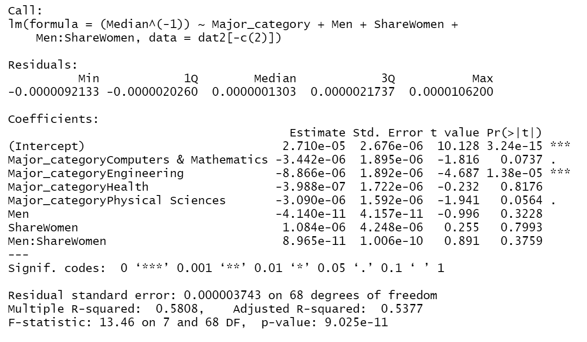

```{r echo=FALSE, warning=FALSE, message=FALSE}
dat1 <- read.csv("women-stem.csv")
library(pacman)
suppressWarnings(p_load(dplyr, ggplot2, ggpubr, scales, MASS, car, lmtest, 
                        ggrepel, faraway, ggcorrplot, GGally))
options(scipen = 100) # remove scientific notation
```

\vspace{-7truemm}

\normalsize

\centering Lydia Gibson, Sara Hatter and Ken Vu

\centering Department of Statistics and Biostatistics, CSU East Bay

\centering STAT 632 - Linear and Logistic Regression

\centering Dr. Joshua Kerr

\centering May 02, 2022

\break

\centering

\raggedright

\tableofcontents

\break

# I. Introduction {#introduction style="h1, h2, h3 {   text-align: center; }"}

\setlength\parindent{24pt}         Do gender-based social roles or top salary impact our choices of career paths? Although many countries, such as China, have incorporated women into their labor force and developed strong economies as a result, women still tend to choose careers that align more with gender stereotypes. Undeniably, the personality characteristics often associated with women are sympathy, kindness, and warmth, which all reflect a sense of concern towards other people. On the other hand, the traits frequently associated with men are achievement orientation and ambitiousness, which are concerned more with accomplishing tasks. These characteristics manifest themselves in the stereotypical association of men with the worker role and women with the family role.

\setlength\parindent{24pt} In response to this gender bias, more schools are encouraging girls to enter STEM programs in addition to providing them with various resources to help them succeed in these types of careers. However, despite these efforts, women still tend to choose careers where the median pay is lower. Thus, our research question tries to find associations within STEM college majors that influence their median wages. Our goals are to explore the data for STEM college majors and to create a predictive model for median wages.

# II. Data Description {style="h1, h2, h3 {   text-align: center; }"}

## a. Data Overview

\setlength\parindent{24pt}        The data was obtained from the American Community Survey 2010-2012 Public Use Microdata Series and has been already subsetted to only have STEM majors (particularly with an interest in women majoring in STEM). For each row in the data set (which represents one major), there's a collection of details and statistics about the major, such as the type of major (i.e., Engineering, Health Science, etc.), the proportion of women in the sample of individuals working in that particular field, and other relevant pieces of information. Within the STEM majors, median wage ranges from $\$26,000$ for Zoology and $\$110,000$ for Petroleum Engineering (Mdn = $\$44350$, M = $\$46118$).

\setlength\parindent{24pt} The data dimensions are seventy-six majors in STEM fields (rows) and nine factors (columns), such as: `Rank`, `Major_code`, `Major`, `Major_category`, `Total`, `Men`, `Women`, `ShareWomen`, and `Median`. For this project, `Major_category` was set as a factor to explore the variation of share of women within major categories and the median wages each major category earns.

## b. Exploratory Data Analysis

\setlength\parindent{24pt}        Through a stacked barplot of gender proportions per major category, the data showed that the biggest proportion of women chose fields related to *Health* and the biggest proportion of men chose fields related to *Engineering* (Figure 1). This is congruent with the gender roles and personality characteristics associated with women in addition to men. \newline

```{r echo=FALSE, warning=FALSE, message=FALSE}

# remove Rank, Major_code, and Major
dat2 <- dat1[,-c(1,2,3)] 
# Get totals for men and women for each major category
dat_stats <- rbind(
  # Get totals for men
  dat2 %>% group_by(Major_category) %>%summarize(Grand_Total = sum(Men), Proportion=Grand_Total/sum(Total)) %>%
mutate(Sex="Men", labelpos=Proportion/2),
# Get totals for women
dat2 %>% group_by(Major_category) %>%summarize(Grand_Total = sum(Women), Proportion=Grand_Total/sum(Total)) %>%
  mutate(Sex="Women", labelpos=1 - (Proportion/2))) %>% mutate(Sex = Sex %>% factor(levels=c("Women","Men")))
#dat_stats

dat_stats %>% ggplot(aes(x=Major_category,y=Proportion,fill=Sex)) +
  stat_summary(geom = "bar", position="fill") +# stack side by side bars
  theme(axis.text.x=element_text(angle = 7.5),# get x axes labels to fit
        plot.title=element_text(size=17, hjust=0.5)) +# center title
  geom_text(aes(label = paste0(round(100*Proportion,2),"%"),y=labelpos),size = 3,) +
  scale_y_continuous(labels = scales::percent_format()) +
  labs(x="Major Category", y="Proportion of Gender (%)",
       title="Gender Proportions per Major Category")
```

***Figure 1:*** Gender proportions per major category.

\newpage

Along with the stacked barplot, a boxplot was generated to help identify outliers in median wages within the major categories (see Figure 2). \newline

```{r echo=FALSE, message=FALSE, warning=FALSE}

bx_plt <- dat2 %>% ggplot(aes(x=Major_category,y=Median)) + geom_boxplot() +
    labs(x="Major Category", y="Median Salary ($ 1000)") + 
  theme(axis.text.x=element_text(angle=90)) + scale_y_continuous(breaks=c(40000,60000,80000,100000),
                     labels=c("40","60","80","100"))
  
# Got the outliers
outlier_pts <- dat1 %>%filter(Median > 100000 |(Median > 60000 & Major_category == "Physical Sciences"))

jitter_plt <- dat1 %>%ggplot(aes(x=Major_category,y=Median, color=Major_category, size=ShareWomen)) +
  geom_jitter(alpha = 1/4) +# make circle transparent to show overlap
  theme(axis.text.x = element_text(angle=90, vjust=0.65),
        plot.subtitle = element_text(hjust=0.5),
        legend.position = c(0.92,0.82)) +
  geom_text(data=outlier_pts, aes(label=Major, size=0.089),nudge_y=2, vjust=-1.6, hjust=0.7) + # label outliers
  labs(x="Major Category", y="") +
  guides(color=FALSE, # remove Major_category legend, remove "a" from legend
         size=guide_legend(override.aes = list(alpha = 1, size = c(3,4.5,5.8)))) +
    scale_y_continuous(breaks=c(40000,60000,80000,100000),
                     labels=c("40","60","80","100"))

ggarrange(bx_plt, jitter_plt, ncol=2)
```

***Figure 2:*** Median wage by major category. \newline

\setlength\parindent{24pt} Here, the boxplot confirmed that *Engineering* contains an outlier (i.e. "Petroleum Engineering") as well as another outlier for "Astronomy and Astrophysics". Both fields have less women compared to men. This procedure showed that there may be a significant difference between median wage by major category. Thus, ANOVA was done to test if there is actually at least one major category that its median wage is significantly different from the rest. The ANOVA test done supports the hypothesis with (F(4, 71) = [16.7], p-[0.00000001013]) \< $\alpha=0.05$.

\newpage

\setlength\parindent{24pt} Then, after removing the columns `Major_code` and `Rank` from our data (which were irrelevant to this project), a scatterplot matrix was created, which revealed that there seemed to be a negative association between `ShareWomen` and `Median` Also, the plot showed that there may be an issue of multicollinearity among `Total`, `Men`, `Women`, and `ShareWomen`. This observation makes sense since the column `Total` consists of the sum of the columns `Men` and `Women`. Likewise, `ShareWomen` refers to the proportion of women within the fields (see Figure 3). \newline

```{r echo=FALSE, warning=FALSE, message=FALSE}
ggpairs(dat2[,c(6,1:5)], c(1,3:6))


```

***Figure 3:*** Scatterplot matrix for correlation insights.

\newpage

## c. Box Cox Transformation

\setlength\parindent{24pt}        The column for median wage `Median` was select as the response variable. During the process of checking normality, linearity, and constant variance, the data showed some skewing. Therefore, a Box-Cox test was performed to see if a transformation was necessary for `Median` (see Figure 4). \newline

```{r echo=FALSE, warning=FALSE, message=FALSE}
lm_full <- lm(Median~.,data=dat2)
boxcox(lm_full, lambda=seq(-2.5, 0.5, by =0.5))
```

***Figure 4:*** Box-Cox with a negative one as a power. \newline

The resulting rounded power was -1, suggesting that an inverse transformation of the response `Median` wage is required to help with skewedness. However, this transformation would complicate the interpretability of the model.

# III. Methods and Results {style="h1, h2, h3 {   text-align: center; }"}

## a. Model Fitting

\setlength\parindent{24pt}        The full addictive model is described by: $$Y = \beta_0 + \beta_{Total} + \beta_{Men} + \beta_{Women} + \beta_{ShareWomen} + \beta_{Majorcategory} + \epsilon$$ \setlength\parindent{24pt} Running this model through the step-wise function using AIC as our criterion ended up removing too many predictors; thus, it was decided to check for interactions to see if this new model would help with this issue. Then, a step-wise process was run to reduce the model's AIC. This process aimed to remove the predictor women because the p-value was large (p = 0.7394 \> $\alpha$ = 0.05).

The final reduced model is described by: \scriptsize$$Y^{-1}= (2.71 \times 10^{-5}) - (3.44 \times10^{-6}) x_1 - (8.87 \times 10^{-6}) x_2 - (3.99 \times 10^{-7}) x_3 - (3.09 \times10^{-6}) x_4 - (4.14 \times 10^{-11}) x_5 + (1.08 \times 10^{-6}) x_6 + (8.98 \times 10^{-11}) x_5 \cdot x_6$$.

\normalsize

The results of the model fit can be found in the figure below. \newline

```{r echo=FALSE, warning=FALSE, message=FALSE}
options(scipen=3)
lm_reduced <- lm((Median^(-1)) ~ Major_category + Men + ShareWomen + Men:ShareWomen,
                 data=dat2[-c(2)])
```

{width="90%"}

***Figure 5:*** Results of fitting the final model. \newline

\setlength\parindent{24pt}Looking at the summary of model fitting (see Figure 5), we can see that we have an adjusted $R^2$ score of 0.5377, which means that roughly 53.77% of the variation in the inverse of `Median` can be explained by the model. While the score is not too low, it does indicate that in practical settings, the model still needs improvement.

We can also see that the predictors `Men`, `ShareWomen`, and the interaction term `Men:ShareWomen` are not statistically significant at any significance level (given their p-values).

In addition, as noted earlier in the subsection **Box Cox Transformation** under the section **Data Description**, model interpretability would be difficult here due to the nature of the transformation. For example, looking at the coefficient for the variable `Major_categoryEngineering`, it can be interpreted to mean that if the major being examined is in the *Engineering* category (and all other predictors would be held constant), the intercept would decrease by roughly $8.866\times10^{-6}$ inverse dollars.

## b. Model Diagnostics

\setlength\parindent{24pt}        To verify the results of the model, a plot of the standardized residuals against the model's fitted values was made in addition to a Q-Q plot of the standardized residuals (see Figure 6 below). \newline

```{r echo=FALSE, warning=FALSE, message=FALSE, fig.height=3}
# Standardized Residual vs Fitted plot
stdresid_plt <- ggplot(mapping=aes(x=lm_reduced$fitted.values, 
                                   y=rstandard(lm_reduced))) + 
  geom_point() + labs(x="Fitted Values", y="Standardized Residuals") + 
  geom_hline(yintercept=0) + labs(title="Residuals vs Fitted") + 
  theme(plot.title = element_text(, size=17, hjust = 0.5)) + geom_smooth(se=F)

# Normal QQ_plot
norm_qqplt <- ggplot(mapping=aes(sample=rstandard(lm_reduced))) + stat_qq() + 
  stat_qq_line() + labs(y="Sample Quantitles", x="Theoretical Quantiles",
                       title="Normal Q-Q Plot") + 
  theme(plot.title = element_text(size=17, hjust = 0.5))

# Display the results
ggarrange(stdresid_plt, norm_qqplt, ncol=2)
```

***Figure 6:*** The residual plot (left) along with the Q-Q plot (right) for the final model. \newline

\setlength\parindent{24pt} Here, in Figure 6, it can be seen on the left that the standardized residuals do not appear to have any discernible relationship with the final model's predicted values. After confirming this interpretation with the studentized Breusch-Pagan test (which gives us p=0.8582 \>$\alpha$ =0.05 ), it can be concluded that the assumption of constant variance for this data set holds up fairly well.

\setlength\parindent{24pt} As for the Q-Q plot, although some of the data points seem to deviate from the Q-Q line at the tail ends of the data distribution, the standardized residuals do seen to follow the Q-Q line fairly well. To confirm this finding, the Shapiro-Wilk test was used, which gave this result - p=0.6165 \>$\alpha$ =0.05. Therefore, it can be concluded that the standardized residuals generally follow a normal distribution so the normality assumption holds up here as well.

## c. Model Prediction

\setlength\parindent{24pt} To see if the goal of creating a predictive model for median wages was achieved, a prediction interval for (`Median`)$^{-1}$ for Statistics and Decision Sciences was run. Also, to better understand the results the inverse was taken to see the answer in the original units (see Table 1). \newline

| **Major**                     | **Major Category**      | **Men** | **Share Women** | **Median** |
|---------------|---------------|---------------|---------------|---------------|
| Statistics & Decision Science | Computers & Mathematics | 2960    | 0.5265          | 45000      |

***Table 1:*** The predicted median wage for Statistics and Decision Science is \$45,000. \newline

\setlength\parindent{24pt}

# IV. Conclusion {style="h1, h2, h3 {   text-align: center; }"}

## a. Summary of Results

\setlength\parindent{24pt}        Based on the research done and the obtained results, here is a general summary of the key insights obtained from them:

-   There is an association with gender and median wage of STEM majors.
-   The median wage of STEM majors can be predicted based on the\
    major category, total number of men in the major and total\
    proportion of women in the major.
-   Since Petroleum Engineering has the highest median salary in this data set (i.e. \$110000) , potential students should consider majoring in this field if median salary is the only factor considered.

## b. Further Research

\setlength\parindent{24pt}        Despite the findings obtained, the data set was found to be too limited to get a thorough look at associations within STEM college majors that influence their median wages. Thus, several potential opportunities for further research have been identified below:

-   If the data set was sex-disaggregated for median wage, it could be used to\
    see the difference in median wage by gender for each major.

-   If time series data existed within this data set, analysis could be done to see how median wage\
    changes with an influx of women and/or exodus of men from a\
    given major.

-   Since this project only looked at STEM majors, it would be interesting\
    to see if these same variables (i.e. `Major_category`, `Men`,\
    `ShareWomen`) are associated with median wage for all majors.

# Bibliography {style="h1, h2, h3 {   text-align: center; }"}

        Etaugh, Claire A., and Judith S. Bridges. *Women's Lives: A Psychological Exploration*. 3rd ed., Pearson, 2013.

Kristof, Nicholas D. *Half the Sky: Turning Oppression into Opportunity for Women Worldwide*. Three Rivers Press, 2010.

# Code Appendix {style="h1, h2, h3 {   text-align: center; }"}

For supplementary R script, visit <https://github.com/lgibson7/Gender-Wage-Inequality-in-STEM>
